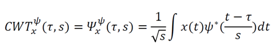
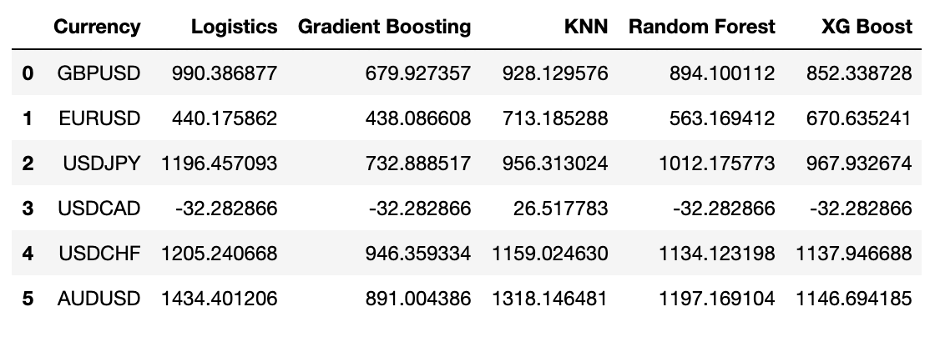

# FX-Algorithm
## 1.	Background Information
When it comes to looking for a broker that can adapt to your trading strategy, there’re a lot of points needed to be paid attention to. Trading platform EBS estimates as much as 70 percent of orders on its platform now originate from algorithms, whereas in 2004, all trading was undertaken by humans, which reveals quant trading as an important way for investors to implement FX investment.
Quant trading relies on mathematical and statistical models to identify (and is often used to execute) trading opportunities, which are driven by quantitative analysis. Determines the probability of a certain outcome occurring by using a data-based model. Unlike other forms of trading, it relies entirely on statistical methods and programming. Because of its character, the challenges it faces are obvious: 1)The lack of data in FX trading compared to stocks. 2)Many traders underestimate the cost of quality data.
Based on the above analysis, we trained our model carefully and complicatedly. Specifically, we trained it with a plethora of high-quality data obtained from Polygon including 1 week, 6 pairs, per minute, 30000 rows of data in total. What’s more, we trained our data in multiple models, the optimist model with the highest accuracy results was chosen. The real-time data simulates trading also shows high return results. And our model also provides risk advice to each transaction.

## 2.	Data Preparation
To begin with, the data was obtained from Polygon.io, which supports Tick data for 16 U.S. stocks trading and Dark Pools trading. According to the report of Bank for International Settlements and Investopedia, we chose six of the most commonly traded currency pairs GBPUSD, EURUSD, USDJPY, USDCAD, USDCHF, and AUDUSD. We used a function to obtain these currency pairs’ rates data. This function allows users to input a dictionary with the information they can easily modify. The dictionary contains below information:
- timespan: time unit
-	multiplier: time quantity
-	from: start time
-	to: end time
-	currencies: Currency pairs want to use. Saved in a list.
-	API Key: personal API Key

For example, we firstly used data from 2021-10-25 to 2021-11-27, every 6 minute’s FX rate to train the model, the input dictionary is as below:
-	timespan: minute
-	multiplier: 6
-	from: 2021-10-25
-	to: 2021-11-27
-	currencies: [‘GBPUSD’, ‘EURUSD’, ‘USDJPY’, ‘USDCAD’, ‘USDCHF’,’ AUDUSD’] 
-	API Key: my API Key

The output function of this model is a four-column data frame, index, timestamp, currency pair, and fx_rate. Particularly noted, the timestamp here is every minute’s 13-bit UTC format code, which we transformed later to date time format and saved in a new column ‘date’ to make our data frame more clear.
The rate we used is each currency pair in every minute’s closing rate, which is a point rate and can be used to define whether to buy or sell this currency at a certain point better. From Arctic and python, we saved our data frame in MongoDB’s Arctic library, which help us to read it conveniently at any time later. We also compress it in zip format to reduce storage and save space.
To make our model more accurate, more data need to feed. We finally used data of 2021-10-25 to 2021-10-29, every 1 minute’s FX rate to train the model. We have 30,000 rows of data, each pair has 5,000 rows. 

## 3.	 Continuous Wavelet Transform (CWT)
After grabbing data from polygon.io, we calculate the return of each point using the formula (T1rate-T0rate)/T0rate. For example, if the rate yesterday is $0.1 and today is $0.2, it’s return is 100% ((0.2-0.1)/0.1), and if the rate yesterday is $0.2 and today is $0.1, it’s return is cut to -50% ((0.1-0.2)/0.2). 
From this example, we could see a problem exists: though the price change is similar, there’s a huge difference in the return rate. We don’t want these things to happen to distract our model, so we need to deduct noise in our return date. 

 
CWT (Continuous Wavelet Transform) to noise reduction. The wavelet transform uses a wavelet base to describe the signal, which is a signal with a very small time scale, so the wavelet transform can describe time. In our project, we used CWT to deal with our return data.

## 4.	Clustering
### (1) Historical Data
Clustering is progress in finding similarities between data according to the characteristics found in the data and grouping similar data objects into clusters. Clustering has below characters: 
- high intra-class similarity (data points in the same cluster should be similar) 
- low inter-class similarity (data points in the different clusters should be dissimilar) 

Different from classification, clustering doesn't label a piece of data beforehand. Clustering is unsupervised learning, while classification is supervised learning. A good clustering method will produce high-quality clusters. Our idea is to cluster the return in 3 clusters:  
1.	Buy cluster: when the return rate is positive. 
2.	Sell cluster: when the return rate is negative. 
3.	Do nothing cluster: when the return rate is close to 0. 

After we got the clusters, we calculate each cluster’s basic statistics: (1) average return for each cluster, (2) standard deviation, and (3) average time duration. We use these basic statistics to determine whether this cluster should be a buy cluster, sell cluster or do noting cluster, and to see how risky this cluster is. If a cluster’s average return is negative, it’ll be a sell cluster, if it’s positive, it’ll be a buy cluster. And if it’s near 0, this is a do-nothing cluster.
### (2) Model Training
Then use five models which are good for analyzing time-series data to train our data: Randomforest Model
-	XGboost Model
-	KNN Model
-	Gradient Boosting Model
-	Logistics Regression

The logic is, with the historical return data and cluster we have, the model will automatically find some relationship between return rate (X) and cluster (Y), therefore we would know that at a new time t with a new return, which cluster it should be classified to and what decision should be made, to buy or sell or do nothing.

## 5.	Sanity check
Overfitting is when the model tries too hard to fit every single one of the data points in the training data while most of the time the "wiggly" pattern is due to noise. Although a more "generalized" model’s training score may look worse, it performs better given new data.
So we use cross-validation to avoid overfitting problems and test our model’s accuracy. We only use 80% of each pairs’ data to train (4000 rows) and test the performance of the model on the other 20% lines previously hidden (1000 rows). Then, we tweak some parameters of your model and re-train our model, and re-evaluate the performance on the other 20%.
We also use soft instead of hard to determine the cluster of each new time point. This means, instead of assigning a specific cluster to a new time point, we calculate the rate of this new time point to each cluster (for example, 1: 0.5, 2: 0.3, 3: 0.2), and we chose the highest rate, which determines this date point’s cluster.

## 6.	Return Analysis & Decision Making
Finally, we use the real-time data to test our model’s performance on the real FX market in real-time. We assume we have a $10,000 cash pool, at each time point we open a position of $1,000, and at the next time point, we closeout. We traded a total of ten lots, the performance of our model is as below:

## 7.	Conclusion
In general, Logistic Regression could be used to generate a better return for most currency pairs. But multiple models could be used to achieve the best return for specific currency pair
AUD/USD, USD/CHF and USDJPY could be invested that has a better return in all models.

 

## Reference:
[1] Triennial Central Bank Survey – Global Forex Market Turnover for April 2019. Triennial Central Bank Survey. Basel, Switzerland: Bank for International Settlements: p. 10. 2019-09-16

[2] What Are the Most Commonly Traded Currency Pairs? 
https://www.investopedia.com/ask/answers/06/maincurrencypairs.asp.

[3] 8 Proven Ways for improving the “Accuracy” of a Machine Learning Model https://www.analyticsvidhya.com/blog/2015/12/improve-machine-learning-results/.

[4] How (not) to use Machine Learning for time series forecasting: Avoiding the pitfalls https://towardsdatascience.com/how-not-to-use-machine-learning-for-time-series-forecasting-avoiding-the-pitfalls-19f9d7adf424.

[5] How to train your machine: JPMorgan FX algos learn to trade better https://www.reuters.com/article/us-jpm-trading-machines/how-to-train-your-machine-jpmorgan-fx-algos-learn-to-trade-better-idUSKCN1S61JG

[6] Multiclass and multioutput algorithms https://scikit-learn.org/stable/modules/multiclass.html.

